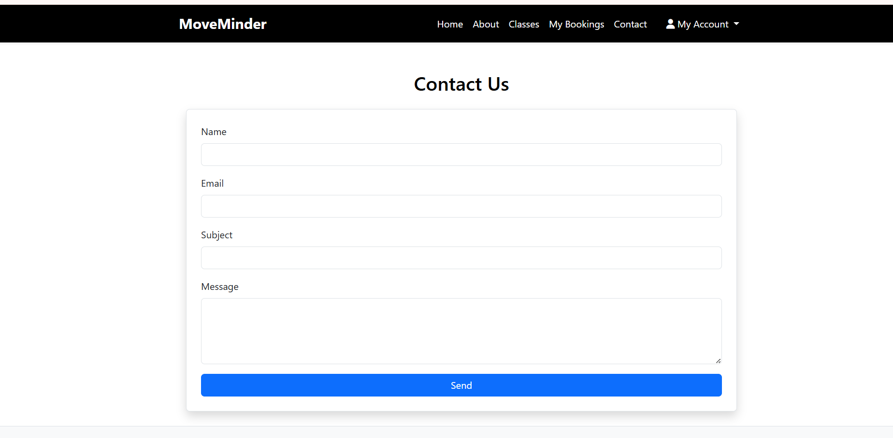

# MoveMinder: Gym Class Booking Platform

MoveMinder is a user-friendly web application designed to help fitness enthusiasts easily browse gym classes, book their preferred sessions, and manage their bookings—all in one place. It features class schedules, booking management, and user authentication to provide a seamless fitness class booking experience.

**Deployed site: [MoveMinder](https://moveminder-8f3f08cb562e.herokuapp.com/)**


# Table of Contents

* [**Goals**](<#goals>)
    * [External User's Goal](<#external-users-goal>)
    * [Site Owner's Goal](<#site-owners-goal>)
* [**User Experience (UX)**](#user-experience)
    * [Entity Relationship Diagram (ERD)](#entity-relationship-diagram-erd)
    * [Wireframes](#wireframes)
    * [User Stories](#user-stories)
    * [Site Structure](#site-structure)
    * [Design Choices and Color Scheme](#design-choices-and-color-scheme)
* [**Features**](#features)
  * [Existing Features](#existing-features)
  * [Future Features](#future-features)
* [**Testing**](#testing)
* [**Deployment**](#deployment)
  * [Forking GitHub Repository](#forking-the-github-repository)
  * [Local Clone](#creating-a-local-clone)
* [**Credits**](#credits)

# Goals

### External User’s Goal:
As an external user, I want to easily browse available gym classes, view class details, book sessions quickly, and manage (view/cancel) my bookings with minimal hassle. The app should be user-friendly, secure, and responsive across devices, enabling me to stay active and plan my fitness schedule efficiently.

### Site Owner’s Goal:
As the site owner, I want to provide a streamlined platform for managing gym classes and bookings, ensuring capacity limits are respected and bookings are tracked per user. I want to offer a clean, maintainable codebase that allows easy updates and scalability, alongside user authentication for personalized experiences.

[Back to top](<#table-of-contents>)

# User Experience

## Entity Relationship Diagram (ERD)


## Wireframes

The wireframes were created with [Balsamiq](https://balsamiq.cloud/sihiecx/p9ewmui/r2278) for desktop and mobile devices.

* ### Home Page


* ### About Page


* ### Classes Page


* ### Booking Page


* ### Contact Page


* ### Success Page


[Back to top](<#table-of-contents>)

## User Stories 

### 🧍‍♂️ As a Site User (Gym Member)
- As a site user, I want to register for an account,
so that I can log in and book gym sessions.

- As a site user, I want to log into my account,
so that I can access my personal dashboard and manage bookings.

- As a site user, I want to view a list of available gym sessions,
so that I can choose one to book.

- As a site user, I want to book a gym session,
so that I can reserve a spot.

- As a site user, I want to view a list of my upcoming bookings,
so that I know when I have sessions scheduled.

- As a site user, I want to cancel a booking,
so that I free up my spot if I can’t attend.

- As a site user, I want to log out of my account,
so that I can end my session securely.

### 👩‍💼 As a Site Admin (Staff/Admin User)
- As a site admin, I want to log into an admin area,
so that I can manage gym session data.

- As a site admin, I want to create new gym sessions,
so that members can book them.

- As a site admin, I want to edit or delete gym sessions,
so that I can keep the schedule up to date.

- As a site admin, I want to view a list of bookings per session,
so that I can monitor attendance.

[Back to top](<#table-of-contents>)

# Site Structure

## Homepage


## About Page


## Classes Page


## Bookings Page


## Contact Us



## Login


## Sign up


## Booking confirmed


## Cancel booking


# Design Choices and Color Scheme

- Clean and Intuitive Interface: The MoveMinder app uses a straightforward layout focused on usability, ensuring users can quickly find and book fitness classes. Navigation is simple, with clear calls to action and minimal distractions.

- Responsive Design: Built with Bootstrap 5, the app adapts seamlessly to different screen sizes, providing an optimal experience on desktops, tablets, and smartphones.

- User Authentication: Secure login and registration processes are integrated to personalize user experiences and protect user data.


#### Color Scheme
- **Primary Colors**: 

Black (#000000): Used predominantly in the navbar and footer, providing a strong and elegant background that emphasizes content.

White (#FFFFFF): Main background color for content areas, ensuring readability and a clean look.

- **Accent Colours**: 

Green (#28a745): Used for buttons and highlights, representing health, vitality, and action (e.g., booking confirmations).

Gray (#6c757d): Used for secondary text and subtle UI elements to maintain a neutral, professional tone.

The combination of black, white, and green creates a modern, energetic, and trustworthy feel, aligning with MoveMinder's mission to motivate users to maintain an active lifestyle.

[Back to top](<#table-of-contents>)

# Features

## Existing Features

- User Registration & Authentication: Users can create accounts, log in, and log out securely.

- Browse Classes: View a list of available gym classes with descriptions and images.

- Class Booking: Logged-in users can book a spot in available classes, selecting date and time slots.

- Booking Validation: Prevents overbooking by limiting bookings to the maximum capacity of each class.

- View Bookings: Users can see their upcoming and past bookings in a dedicated “My Bookings” section.

- Cancel Bookings: Users can cancel their booked classes to free up spots for others.

- Responsive Design: The app layout works smoothly on mobile devices and desktops.

[Back to top](<#table-of-contents>)

## Future Features

As the **MoveMinder** platform evolves, additional features will be added to improve user experience:

- Class Ratings & Reviews: Allow users to rate and review classes they attended.

- Waitlist System: Enable users to join a waitlist for fully booked classes and get notified if a spot opens up.

- Admin Panel: For site owners to manage classes, view bookings, and generate reports.

- Email Notifications: Send confirmation, reminders, and cancellation emails to users.

- Calendar Integration: Sync bookings with popular calendar apps for easier schedule management.

[Back to top](<#table-of-contents>)

# Technologies Used

## Languages
* [Python](https://en.wikipedia.org/wiki/Python_(programming_language))
* [HTML5](https://en.wikipedia.org/wiki/HTML)
* [CSS3](https://en.wikipedia.org/wiki/CSS)
* [JavaScript](https://en.wikipedia.org/wiki/JavaScript)

## Frameworks & Software
* [Django](https://www.djangoproject.com/)
* [Cloudinary](https://cloudinary.com/)
* [Bootstrap](https://getbootstrap.com/)
* [Heroku](https://en.wikipedia.org/wiki/Heroku)
* [Emailjs](https://dashboard.emailjs.com/admin)
* [Google Maps](https://developers.google.com/)

### Other
- Visual Studio Code
- Font awesome
- Github 
- Unsplashed
- Fontjoy
- Google fonts
- Pexels
- Favicon.cc
- W3C Jigsaw CSS Validator
- Colorfilter
- FancyApp
- Code institute learning

[Back to top](<#table-of-contents>)

## Testing
### Css


## Testing
### Css


## Deployment

For good practice, this project was deployed early to [Heroku](https://www.heroku.com) for cautionary reasons.

After installing Django and the supporting libraries, the basic Django project was created and migrated to the database. 

The database provided by Django [db.sqlite3](https://docs.python.org/3/library/sqlite3.html) is only accessible within the workspace environment. In order for Heroku to be able to access the database, a new database suitable for production needs to be created.  Heroku offers a postgres add-on at an extra charge. I am using a postgreSQL database instance hosted on [CI Database](https://dbs.ci-dbs.net/) as this service is free. 

<details>
<summary>Steps taken before deploying the project to Heroku</summary>

### Create the Heroku App

1. Login to Heroku and click on the top right button ‘New’ on the dashboard. 
2. Click ‘Create new app’.
3. Give your app a unique name and select the region closest to you. 
4. Click on the ‘Create app’ button.

### Create the PostgreSQL Database

1. Login to https://dbs.ci-dbs.net/.
2. step 1: enter your email address and submit.  
3. step 2: creates a database.  
4. step 3: receive the database link on your email id. 

### Create the env.py file

With the database created, it now needs to be connected with the project.  Certain variables need to be kept private and should not be published to GitHub.  

1. In order to keep these variables hidden, it is important to create an env.py file and add it to .gitignore.  
2. At the top **import os** and set the DATABASE_URL variable using the `os.environ` method. Add the URL copied from instance created above to it, like so:
`os.environ[“DATABASE_URL”] = ”copiedURL”`
3. The Django application requires a SECRET_KEY to encrypt session cookies.  Set this variable to any string you like or generate a secret key on this [MiniWebTool](https://miniwebtool.com/django-secret-key-generator/).
`os.environ[“SECRET_KEY”] = ”longSecretString”`

### Modify settings.py 

It is important to make the Django project aware of the env.py file and to connect the workspace to the new database. 

1. Open up the settings.py file and add the following code. The if statement acts as a safety net for the application in case it is run without the env.py file.
```
import os
import dj_database_url

if os.path.isfile(‘env.py’):
    import env
```
2. Remove the insecure secret key provided by Django and reference the variable set in the env.py file earlier, like so:
```
SECRET_KEY = os.environ.get(‘SECRET_KEY’)
```
3. Hook up the database using the dj_database_url import added above.  The original DATABASES variable provided by Django connects the Django application to the created db.sqlite3 database within your repo.  This database is not suitable for production so comment out the existing db.sqlite3 and include the command as below for the new database. 

```
# Database
# https://docs.djangoproject.com/en/5.0/ref/settings/#databases

# DATABASES = {
#   'default': {
#       'ENGINE': 'django.db.backends.sqlite3',
#       'NAME': BASE_DIR / 'db.sqlite3',
#   }
# }

DATABASES = {
    'default': dj_database_url.parse(os.environ.get("DATABASE_URL"))
}
```

**NOTE**: If at the start of the development you are using the local db.sqlite3, make sure to add it to the .gitignore file, so as not to make the mistake of pushing it to your repository.  

5. Save and migrate this database structure to the newly connected postgreSQL database.  Run the migrate command in your terminal
`python3 manage.py migrate`

### Connect the Database to Heroku

1. Open up the Heroku dashboard, select the project’s app and click on the ‘Settings’ tab.
2. Click on ‘Reveal Config Vars’ and add the DATABASE_URL with the value of the copied URL from the database instance created on CI database.
3. Also add the SECRET_KEY with the value of the secret key added to the env.py file. 
4. If using gitpod another key needs to be added in order for the deployment to succeed.  This is PORT with the value of 8000.

### Setup the Templates Directory

In settings.py, add the following under BASE_DIR 
`DIRS = os.path.join(BASE_DIR, "templates")`

### Add the Heroku Host Name

In settings.py scroll to ALLOWED_HOSTS and add the Heroku host name.  This should be the Heroku app name created earlier followed by `.herokuapp.com`.  Add in `’localhost’` so that it can be run locally.
```
ALLOWED_HOSTS = [‘heroku-app-name.herokuapp.com’, ‘localhost’]
```

### Create the Directories and the Process File

1. Create the media, static and templates directories at the top level next to the manage.py file. 
2. At the same level create a new file called ‘Procfile’ with a capital ‘P’.  This tells Heroku how to run this project.  
3. Add the following code, including the name of your project directory. 
```
web: gunicorn bitcoin_buzz.wsgi
```
* ‘web’ tells Heroku that this a process that should accept HTTP traffic.
* ‘gunicorn’ is the server used.
* ‘wsgi’, stands for web services gateway interface and is a standard that allows Python services to integrate with web servers.
4. Save everything and push to GitHub. 

</details>

<details>
<summary>First Deployment</summary>

### First Deployment

1. Go back to the Heroku dashboard and click on the ‘Deploy’ tab.  
2. For deployment method, select ‘GitHub’ and search for the project’s repository from the list. 
3. Select and then click on ‘Deploy Branch’.  
4. When the build log is complete it should say that the app has been successfully deployed.
5. Click on the ‘Open App’ button to view it and the Django “The install worked successfully!” page, should be displayed. 

</details>

<details>
<summary>Final Deployment</summary>

### Final Deployment

1. When development is complete, if you had left `DEBUG = True` in the settings.py file, make sure to change it to `False`. You don't have to change anything if you had used `DEBUG = 'DEVELOPMENT' in os.environ` as your env.py file is ignored by GitHub. 
2. Commit and push your code to your project's repository.
3. Then open up Heroku, navigate to your project's app. Click on the 'settings' tab, open up the config vars and delete the DISABLE_COLLECTSTATIC variable. 
4. Navigate to the 'Deploy' tab and scroll down to 'Deploy a GitHub branch'.
5. Select the branch you want to deploy and click on the 'Deploy branch' button. When the app is deployed, you should see a message in the built log saying "Your app was successfully deployed".  Click 'View' to see the deployed app in the browser. Alternatively, you can click on the 'Open App' button at the top of the page. 

</details>

_____

### Forking the GitHub Repository

<details>
<summary>Steps to Fork the GitHub Repository</summary>

Forking allows you to view and edit the code without affecting the original repository

1. Locate the GitHub repository. Link to this repository can be found [here](https://github.com/CsClown/bitcoin-buzz).
2. Click on 'Fork', in the top right-hand corner.
3. This will take you to your own repository to a fork with the same name as the original branch.

</details>

_____

### Creating a Local Clone

<details>
<summary>Steps to Creating a Local Clone</summary>

1. Go to the GitHub repository. Link to this repository can be found [here](https://github.com/CsClown/bitcoin-buzz).
2. Click on 'Code' to the right of the screen. This will open a dropdown. Click on HTTPs and copy the link.
3. Open Git Bash in your IDE and change the current working directory to the location where you want the cloned directory.
4. Type `git clone`, paste the URL you copied earlier, and press Enter to create your local clone.

More information on Creating and Managing repositories can be found [here](https://docs.github.com/en/repositories/creating-and-managing-repositories/cloning-a-repository)
<br>

</details>

[Back to top](<#table-of-content>)

# Credits
## Images
* Andrea Piacquadio [Pexels](https://www.pexels.com/)
* Yan Krukau [Pexels](https://www.pexels.com/)
* Zakaria Boumliha [Pexels](https://www.pexels.com/)
* Gustavo Fring [Pexels](https://www.pexels.com/)


# Acknowledgements
I would like to thank my Sister Hazel Hawadi for being the greatest support during this project.

